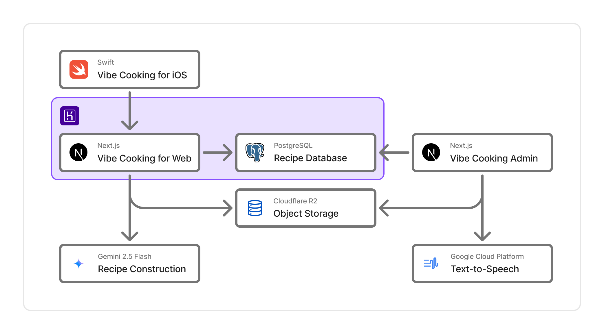

# Vibe Cooking Web

[](https://github.com/kantacky/vibe-cooking-web/actions/workflows/ci.yml)

## Vibe Cookingとは

Vibe Cookingは、AIを活用したレシピ構築と音声コントロールにより、今までの料理体験の常識を覆します。

スマートフォンやタブレットでレシピを見ながら料理をするとき、以下のような悩みがあると考えました。

- 料理中に視線が画面と手元を行ったり来たりして面倒
- 手が濡れている時にスマホを触りたくない
- 複数の料理を調理するには、複数のレシピのページを行ったり来たりしないといけない

これらの問題を解決するために

- 音声でレシピを読み上げ
- ユーザが声でレシピを操作
- AIによって複数料理の最適手順の提案

という機能を実装しました。

### 関連リンク

- URL: https://vibe-cooking.app
- iOS版リポジトリ: https://github.com/furarico/vibe-cooking-ios

## クイックスタート

```
git clone https://github.com/furarico/vibe-cooking-web
```

```
pnpm install
```

```
cp .env.development.example .env.local
```

```
pnpm api:generate
```

```
pnpm dev
```

## 🔧 技術スタック

### フロントエンド

- React
- Next.js
- TypeScript
- Tailwind CSS
- shadcn/ui

### データベース・API

- Prisma
- @prisma/client
- openapi-fetch
- PostgreSQL

### AI・認証

- @google/genai
- firebase

### 開発・テスト

- Jest
- @testing-library/react
- Storybook
- ESLint
- Prettier

### ツール・その他

- openapi-typescript
- @redocly/cli
- dotenv-cli
- pnpm
- PWA

## システムアーキテクチャ



&copy; 2025 ギャFUN!!
